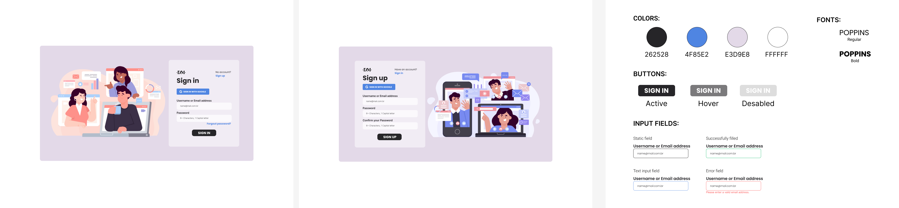

# Login - vuejs

This is a simple and responsive login form made with Vue.js framework, using the Vuetify library for the interface components, Vue Router for the route configuration and VeeValidate for the mandatory fields configuration. 

## Design

Design made in figma software and used for inspiration when moving to code.


## Project setup
```
npm install
```

### Compiles and hot-reloads for development
```
npm run serve
```

### Compiles and minifies for production
```
npm run build
```

### Lints and fixes files
```
npm run lint
```

### Customize configuration
See [Configuration Reference](https://cli.vuejs.org/config/).

-----------------
Coded by [Dyovana Menegatti](https://github.com/dyomenegatti).
